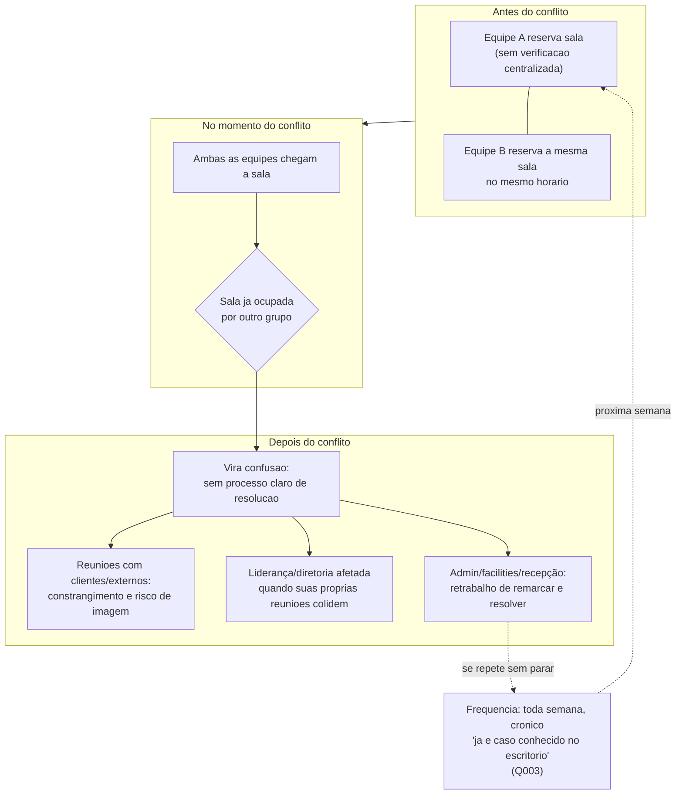
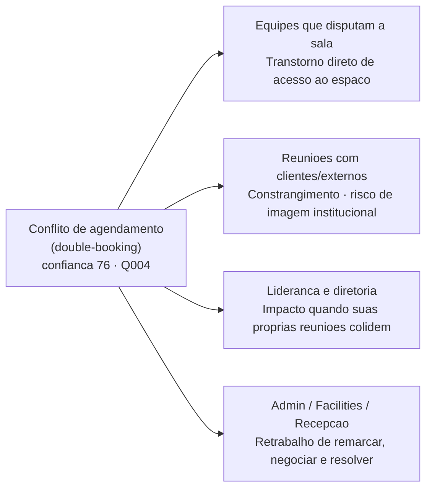
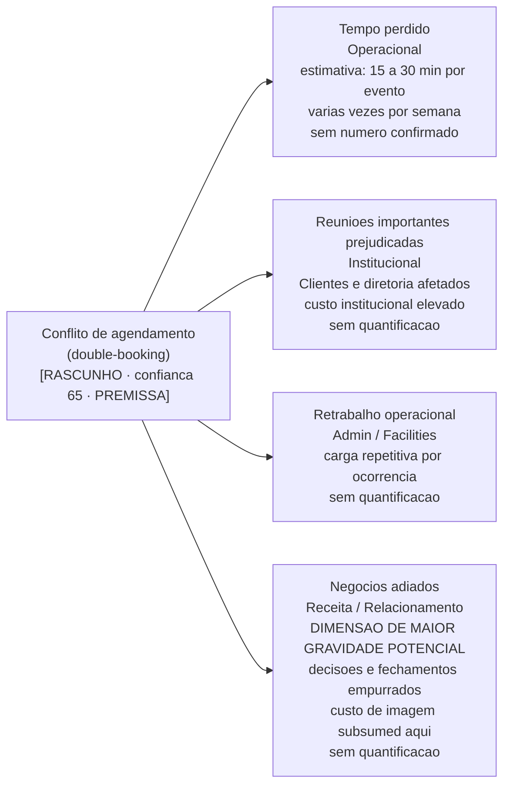
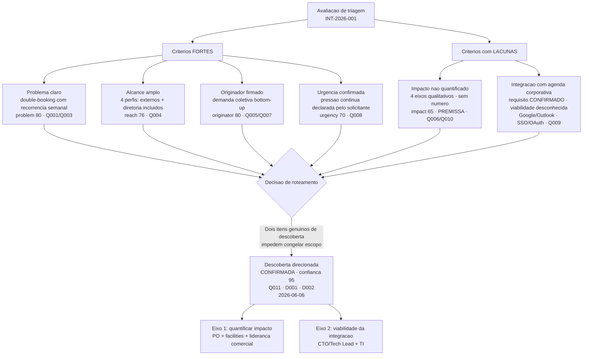
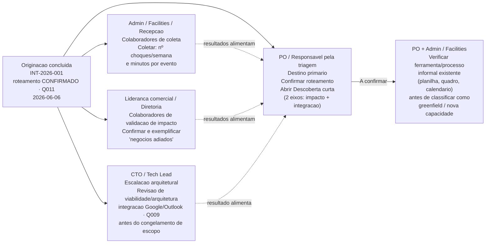

# Registro de originação: sistema de reserva de salas de reunião

> Artefato formal de originação. Consolida a demanda capturada, registra o nível de maturidade com que ela chegou e carrega um rascunho de triagem (decisão de roteamento) sempre sinalizado para aprovação humana. Este documento é autocontido.

## Metadados

| Campo | Valor |
|---|---|
| **ID do registro** | INT-2026-001 |
| **Versão** | v1 |
| **Originador (solicitante)** | Solicitante (canalizador) + reclamações coletivas internas |
| **Triado por (responsável)** | Solicitante (canalizador da demanda), confirmado na sessão de originação |
| **Data de registro** | 2026-06-06 |
| **Data de triagem** | 2026-06-06 |
| **Situação** | Triado: Descoberta direcionada |
| **Linguagem de saída** | pt-BR |

## Histórico de revisões

| Versão | Data | Evento | Resumo |
|---|---|---|---|
| v1 | 2026-06-06 | Originação rascunhada | Captura inicial via origination-brainstorm; seções de captura preenchidas a partir do ledger Q001-Q006. |
| v2 | 2026-06-06 | Atualização pós-checkpoint | Seções `originator`, `urgency`, `constraints` e `impact` atualizadas com respostas Q007-Q010. Conflito de eixo-imagem resolvido. Metadado Originador atualizado. |
| v3 | 2026-06-06 | Seções derivadas recompostas pelo Sintetizador | `readiness` atualizado para ~74% (urgência respondida Q008, reach 76, originator 80). `triage` recomposto: decisão Descoberta direcionada, confiança ~66, nota de tensão atualizada. `cto_escalation` promovida a SIM por integração com agenda confirmada (Q009). `handoff` e `discovery` alinhados à nova triagem. |
| v4 | 2026-06-06 | Confirmação humana da triagem (Q011) | Decisão de roteamento confirmada pelo solicitante em 2026-06-06 (D001/D002). Banner ⚠️ substituído por confirmação ✅ na triagem e no encaminhamento. Metadados de triagem preenchidos. Confiança do alcance alinhada de 75 para 76 (reconciliação cosmética). |

---

## Maturidade recebida

| Campo | Valor |
|---|---|
| **Pontuação de maturidade** | ~74% |
| **Requisitos bloqueantes** | Sim: todos resolvidos por confiança ou disposição honesta. `problem` (80) acima do min-confidence=80; `originator` (80) e `reach` (76) acima do limiar; `impact` (65) abaixo do min-confidence=70, carregado como **PREMISSA** declarada (único elo abaixo do limiar). |
| **Disposições abertas** | 3 premissas a validar · 0 descoberta · 0 adiada |

**Racional de maturidade:** maturidade moderada-alta, limitada por um único elo fraco. Problema forte (80), originador firmado (demanda coletiva canalizada, 80), alcance amplo (76), urgência RESPONDIDA: pressão contínua confirmada (70), não mais inferida. Único elo abaixo do limiar: impacto (65, premissa), confirmado em 4 eixos qualitativos mas sem quantificação. Gate fecha por disposição honesta. Pontuação ~74% (média de 80 / 76 / 65 / 80 / 70), acima da rev anterior (~68%).

> **RASCUNHO: eixo Impacto abaixo do limiar (65 < 70); radar mistura seções confirmadas com premissa.**

```mermaid
radar
  title "Perfil de maturidade da demanda [RASCUNHO: Impacto = PREMISSA]"
  options
    max 100
  axes
    Problema, Originador, Alcance, Urgencia, Impacto
  data
    Confianca registrada
      80, 80, 76, 70, 65
    Limiar minimo
      70, 70, 70, 70, 70
```

**Legenda V04:** Pontuacao de maturidade geral: ~74%. O eixo "Impacto" (65) e o unico abaixo do limiar minimo de 70, carregado como PREMISSA declarada. Os demais eixos estao confirmados. Valores: Problema 80 | Originador 80 | Alcance 76 | Urgencia 70 | Impacto 65 (premissa).

*"Perfil de maturidade da demanda por seção: cinco dimensões, um elo abaixo do limiar (impacto = 65)."*

---

## Demanda consolidada

### Problema (a dor, não a solução)

O problema central é o **conflito de agendamento** (double-booking): pessoas marcam reuniões em salas que já estão ocupadas por outra reunião no mesmo horário. Quando os dois grupos chegam à sala, "vira confusão": não há processo claro de resolução e a situação se repete. O conflito acontece **toda semana, sem parar** e já é caso conhecido no escritório, caracterizando uma dor crônica e rotineira, não uma exceção isolada. (Q001, Q003)



*"Como o conflito de agendamento se manifesta hoje: do duplo-booking ao retrabalho semanal."*

### Originador e contexto

A demanda é canalizada pelo **solicitante desta sessão**, mas a dor é **coletiva**: ele reúne e representa várias reclamações recorrentes de colegas. O canal de origem é bottom-up: reclamações internas acumuladas que tornaram o problema visível o suficiente para gerar uma proposta de solução. O solicitante não se identificou nominalmente, mas sua titularidade está clara: canalizador mais grupo de reclamantes internos. A origem não é uma diretriz top-down nem a dor de uma única pessoa. (Q005 + Q007)

### Quem é impactado (alcance)

O conflito de salas atinge quatro perfis distintos, confirmados pelo solicitante: (Q004)

- **Equipes que disputam a sala:** transtorno direto para quem chegou para usar o espaço e encontrou outro grupo já ocupando.
- **Reuniões com clientes e externos:** o conflito gera constrangimento e risco de imagem institucional quando visitantes externos estão presentes.
- **Liderança e diretoria:** a gestão é diretamente impactada quando suas próprias reuniões colidem com outras.
- **Quem organiza o escritório (organização do escritório / facilities / recepção):** absorve o retrabalho de remarcar, negociar e resolver cada ocorrência.

O alcance é amplo e multi-perfil, o que eleva a urgência percebida.



*"Quem sente o conflito de agendamento e como: quatro perfis, impactos distintos."*

### Impacto de negócio

O custo do conflito de salas tem quatro eixos, todos confirmados pelo solicitante. Nenhuma dimensão foi quantificada numericamente; todos os valores abaixo são estimativas qualitativas a validar: (Q006 + Q010)

- **Tempo perdido (operacional):** a cada conflito de agendamento há pessoas paradas enquanto a reunião atrasa, com estimativa implícita de 15 a 30 minutos por evento, várias vezes por semana.
- **Reuniões importantes prejudicadas (institucional):** não são apenas reuniões rotineiras afetadas. Reuniões com clientes e com a diretoria são atingidas, com custo institucional mais elevado.
- **Retrabalho operacional:** a organização do escritório (facilities) absorve o esforço de remarcar e resolver cada ocorrência, gerando carga repetitiva sobre quem administra o espaço.
- **Negócios adiados (receita / relacionamento):** reuniões de negócio que não acontecem no horário previsto empurram decisões e fechamentos para frente, gerando custo de oportunidade em receita e relacionamento (**dimensão de maior gravidade potencial**). O custo de imagem/relacionamento com clientes e externos está **subsumido** neste eixo (confirmado pelo solicitante em Q010, não é dimensão separada).

Nenhum valor foi quantificado: não há número de conflitos por semana, minutos estimados por evento ou indicação de negócios concretamente adiados.

> **RASCUNHO: PREMISSA QUALITATIVA. Impacto confianca=65, abaixo do limiar 70. Nenhum valor numerico existe. Eixos confirmados qualitativamente pelo solicitante; magnitudes a quantificar na Descoberta.**



*"Eixos de custo do conflito de agendamento, premissa qualitativa a quantificar na Descoberta. [RASCUNHO]"*

### Urgência: por que agora

A urgência é **pressão contínua**, confirmado diretamente pelo solicitante (Q008). Não há gatilho específico, prazo ou janela de oportunidade que motive a resolução agora: o que move é a persistência crônica do problema (frequência semanal confirmada em Q003) e o acúmulo de reclamações ao longo do tempo. A ausência de deadline é ela mesma a resposta. O custo de esperar é concreto: cada semana sem solução representa novos conflitos de agendamento, mais retrabalho operacional e mais reuniões importantes prejudicadas.

### Prioridade declarada

**Nível:** Não declarado. **Motivo:** O solicitante não declarou prioridade durante a sessão de originação. Não foi perguntado explicitamente.

---

## Sinal de natureza: software novo vs. existente

**Toca:** Nova capacidade. A declaração de abertura ("quero um sistema para reservar salas") indica que não existe hoje nenhuma ferramenta ou processo formalizado de reserva de salas. Não há menção a sistema existente a ser alterado.

---

## Triagem: decisão de roteamento

> DECISÃO CONFIRMADA pelo solicitante em 2026-06-06 (substitui o rascunho de IA).

**Confiança · Disposição:** 95 · confirmada

Situação: Triado. Decisão firmada pelo solicitante (Q011, 2026-06-06). Referências ao ledger de decisões da iniciativa: D001 (Descoberta direcionada aprovada) e D002 (Escalação arquitetural confirmada).

### Critérios de triagem

| Critério | Avaliação |
|---|---|
| **Clareza do problema** | Forte: conflito de agendamento (double-booking) com sintomas observáveis e recorrência semanal (problem 80, Q001/Q003) |
| **Alcance** | Forte: quatro perfis, incluindo externos (imagem) e diretoria (reach 76, Q004) |
| **Impacto de negócio** | Fraco / não quantificado: quatro eixos qualitativos, nenhum valor quantificado; marcado **premissa** (impact 65, Q006/Q010). Item genuíno de descoberta. |
| **Urgência: por que agora** | Respondida: pressão contínua confirmada pelo solicitante (urgency 70, Q008); sem prazo específico, mas não mais inferida. |
| **Maturidade das premissas** | Aberta: 3 premissas materiais a validar + 1 incógnita técnica CONFIRMADA: viabilidade da integração com agenda corporativa (Google/Outlook, Q009). |

### Decisão de roteamento

| Campo | Valor |
|---|---|
| **Decisão** | Descoberta (Discovery), direcionada, CONFIRMADA |
| **Justificativa** | Quadro mais forte (problema, alcance, originador, urgência sólidos), mas persistem 2 itens genuínos de descoberta que impedem congelar escopo: (1) impacto não quantificado (premissa de VALOR) e (2) viabilidade da integração com agenda corporativa, agora requisito CONFIRMADO (Q009) e portanto incógnita técnica/arquitetural real. Decisão fica em Descoberta, estreitada a esses dois eixos, em vez de promover a "Pronto para Produto" prematuramente. |

> **Nota de tensão:** os fundamentos já sustentariam "Pronto para Produto": problema, alcance, originador e urgência são sólidos. O que segura são duas incógnitas materiais específicas: impacto qualitativo (premissa de valor) e integração com agenda corporativa (incerteza de viabilidade), não fraqueza geral. Se o responsável aceitar o impacto qualitativo E tratar a integração como risco de elaboração, pode promover diretamente; o rascunho recomenda Descoberta curta focada nesses dois itens.



*"Decisão de triagem: Descoberta direcionada confirmada, dois itens genuínos de descoberta impedem congelamento de escopo."*

---

## Escalação arquitetural

**Confiança · Disposição:** ~75 · inferida

Escalação ao CTO antes de congelar escopo? **SIM**: revisão de viabilidade/arquitetura da integração com agenda corporativa.

O núcleo é CRUD de agenda básico, sem gatilhos arquiteturais clássicos (sem pagamentos, multi-tenancy, segurança nova, IA/runtime, nova infraestrutura). A integração com agenda corporativa (Google Calendar e/ou Outlook) é agora **requisito CONFIRMADO** (Q009, constraints 72): integração com incógnitas (qual plataforma, APIs corporativas, SSO/OAuth, modelo de sincronização), exatamente o gatilho previsto. Confiança elevada porque `constraints` não está mais vazia.

**Razão (uma linha):** integração confirmada com agenda corporativa é integração com incógnitas, o que justifica revisão de viabilidade/arquitetura antes do congelamento de escopo.

---

## Premissas

| Premissa | Veredicto (rascunho) | Validar com |
|---|---|---|
| A magnitude do impacto (tempo perdido, reuniões prejudicadas, retrabalho) é estimativa qualitativa, não quantificada | A validar | PO + quem organiza as salas (organização do escritório / facilities): coletar nº de choques/semana e minutos por evento |
| "Negócios adiados" representa custo real de receita/relacionamento | A validar | Liderança comercial / diretoria: solicitar exemplos concretos de negócios ou decisões que foram adiados por conflito de sala e estimar impacto |
| Não existe nenhuma ferramenta formal de reserva de salas em uso hoje (greenfield / nova capacidade) | A validar | PO + organização do escritório / facilities: confirmar se há planilha, quadro, calendário compartilhado ou qualquer processo informal em uso |

---

## Restrições

| Restrição | Tipo | Observação |
|---|---|---|
| A solução **precisa integrar com a agenda corporativa** (Google Calendar e/ou Outlook) | Técnica | Restrição firme declarada pelo solicitante (Q009). Desambiguação pendente: uma plataforma ou ambas? Há requisitos de SSO ou acesso a APIs corporativas? Detalhes de escopo, sem bloquear o gate de originação. |

Fora a integração com agenda corporativa, nenhuma outra restrição foi declarada: sem orçamento definido, sem prazo e sem restrições de complexidade informadas (Q009).

---

## Briefing de descoberta

| Incógnita | Por que importa | Como investigar | Prazo fechado | Resultado |
|---|---|---|---|---|
| Magnitude quantificada do impacto (nº choques/semana × min/evento) | Define se o valor justifica priorizar agora; hoje 100% qualitativo (impact 65, premissa) | Coletar registros / observação com organização do escritório / facilities / recepção | 1 semana | (em aberto) |
| "Negócios adiados" é custo real de receita / relacionamento? | Eixo de maior gravidade potencial, não comprovado | Entrevistar liderança comercial / diretoria por exemplos concretos | 3 dias | (em aberto) |
| Viabilidade da integração com agenda corporativa (Google Calendar / Outlook) | Requisito CONFIRMADO (Q009): gatilho de escalação arquitetural; definir plataforma(s), APIs corporativas, SSO/OAuth, modelo de sincronização | Revisão de viabilidade/arquitetura com Tech Lead/CTO + TI | 1 semana | (em aberto) |
| Existe ferramenta / processo informal hoje (greenfield / nova capacidade vs. brownfield)? | Define natureza da demanda e escopo | Confirmar com PO + organização do escritório / facilities | 2 dias | (em aberto) |

**Prazo fechado total sugerido:** ~1 a 1,5 semana.

> Nota: linha de urgência encerrada, respondida em Q008. Integração com agenda corporativa promovida de "possível gatilho" a requisito confirmado a investigar.

| # | Incognita | Por que importa | Investigar com | Prazo | Prioridade |
|---|---|---|---|---|---|
| 1 | Magnitude quantificada do impacto (nº choques/semana x min/evento) | Define se o valor justifica priorizar agora; hoje 100% qualitativo (impact 65, premissa) | Admin / Facilities / Recepcao | 1 semana | Alta |
| 2 | "Negocios adiados" e custo real de receita/relacionamento? | **Dimensao de maior gravidade potencial**, nao comprovada | Lideranca comercial / Diretoria | 3 dias | Critica |
| 3 | Viabilidade da integracao com agenda corporativa (Google/Outlook): plataforma(s), APIs, SSO/OAuth, sincronizacao | Requisito CONFIRMADO (Q009) · **Gatilho de escalacao arquitetural ao CTO** | Tech Lead / CTO + TI | 1 semana | Critica |
| 4 | Existe ferramenta/processo informal hoje? (greenfield vs. brownfield) | Define natureza da demanda e escopo | PO + Admin / Facilities | 2 dias | Alta |

**Prazo total sugerido:** ~1 a 1,5 semana. Incognitas 2 e 3 sao criticas: uma define o valor de negocio do projeto; a outra determina se a arquitetura e viavel no escopo planejado.

*"Quatro incógnitas a resolver na Descoberta direcionada: prioridade, responsável e horizonte de tempo."*

---

## Encaminhamento

> ROTEAMENTO CONFIRMADO pelo solicitante em 2026-06-06: Descoberta direcionada. Execução pendente do início formal da fase de Descoberta.

- **Destino primário:** Product Owner / responsável pela triagem: confirmar roteamento e abrir descoberta curta focada em dois eixos: quantificação de impacto e viabilidade da integração com agenda.
- **Escalação arquitetural (CTO / Tech Lead):** acionar revisão de viabilidade/arquitetura da integração com agenda corporativa (Google/Outlook), requisito confirmado (Q009), antes do congelamento de escopo.
- **Colaboradores (organização do escritório / facilities / recepção):** coletar nº de choques/semana e minutos por evento.
- **Colaboradores (liderança comercial / diretoria):** confirmar e exemplificar "negócios adiados".
- **A confirmar (PO + organização do escritório / facilities):** verificar se já existe ferramenta / processo informal (planilha, quadro, calendário) antes de classificar como greenfield (nova capacidade).



*"Encaminhamento pós-originação: quatro destinos com responsabilidades distintas na Descoberta direcionada."*

---

## Fontes e registro de perguntas

> Origem dos dados: Demanda capturada exclusivamente por entrevista com o Solicitante (sessão de originação de 2026-06-06). Nenhum arquivo de referência foi fornecido.

### Perguntas e respostas

**Q001** Problema (confiança 45, respondida)
- **Pergunta:** Qual é a dor inicial relatada?
- **Resposta:** "Salas já ocupadas, vira confusão", conflito de agendamento (double-booking) sem processo claro de resolução.
- **Fonte:** Solicitante direto (entrevista de originação, 2026-06-06)
- **Confiança:** 45 (initial capture)
- **Disposição:** respondida
- **Alimenta:** Seção Problema

---

**Q003** Problema (confiança 80, respondida)
- **Pergunta:** Com que frequência ocorre o conflito de agendamento?
- **Resposta:** "Toda semana / direto", frequência crônica, semanal e sem parar.
- **Fonte:** Solicitante direto (entrevista de originação, 2026-06-06)
- **Confiança:** 80
- **Disposição:** respondida
- **Alimenta:** Seção Problema (eleva confiança a 80, caracteriza dor crônica)

---

**Q004** Alcance e impacto (confiança 75/76, respondida)
- **Pergunta:** Quais perfis são afetados pelo conflito de agendamento?
- **Resposta:** Quatro perfis confirmados: equipes que disputam a sala; reuniões com clientes/externos (risco de imagem); liderança e diretoria; admin/facilities/recepção (retrabalho).
- **Fonte:** Solicitante direto (entrevista de originação, 2026-06-06)
- **Confiança:** 76 (ajustada de 75 em reconciliação cosmética)
- **Disposição:** respondida
- **Alimenta:** Seção Quem é impactado

---

**Q005** Originador (confiança 75, respondida)
- **Pergunta:** Como chegou a demanda, por qual canal?
- **Resposta:** "Reclamação recorrente", canal bottom-up, reclamações internas acumuladas.
- **Fonte:** Solicitante direto (entrevista de originação, 2026-06-06)
- **Confiança:** 75
- **Disposição:** respondida
- **Alimenta:** Seção Originador e contexto

---

**Q006** Impacto (confiança 62→65, premissa)
- **Pergunta:** Quais são os eixos de custo do conflito de agendamento?
- **Resposta:** Quatro eixos identificados qualitativamente: tempo perdido, reuniões importantes prejudicadas, retrabalho operacional, negócios adiados. Nenhum foi quantificado numericamente.
- **Fonte:** Solicitante direto (entrevista de originação, 2026-06-06)
- **Confiança:** 65 (premissa, sem quantificação)
- **Disposição:** premissa
- **Alimenta:** Seção Impacto de negócio

---

**Q007** Originador (confiança 80, respondida)
- **Pergunta:** Qual é o papel do solicitante na demanda?
- **Resposta:** "Fui eu + outros reclamantes", canalizador da dor coletiva; não é a dor de uma única pessoa nem uma diretriz top-down.
- **Fonte:** Solicitante direto (entrevista de originação, 2026-06-06)
- **Confiança:** 80
- **Disposição:** respondida
- **Alimenta:** Seção Originador e contexto

---

**Q008** Urgência (confiança 70, respondida)
- **Pergunta:** Por que resolver agora? Há prazo ou janela de oportunidade?
- **Resposta:** "Pressão contínua", sem prazo específico; o que move é a persistência crônica do problema e o acúmulo de reclamações.
- **Fonte:** Solicitante direto (entrevista de originação, 2026-06-06)
- **Confiança:** 70
- **Disposição:** respondida
- **Alimenta:** Seção Urgência: por que agora

---

**Q009** Restrições (confiança 72, respondida)
- **Pergunta:** Existem restrições técnicas ou de negócio que limitam a solução?
- **Resposta:** "Integrar com agenda corporativa (Google Calendar e/ou Outlook)", restrição técnica firme declarada. Sem outras restrições de orçamento, prazo ou complexidade.
- **Fonte:** Solicitante direto (entrevista de originação, 2026-06-06)
- **Confiança:** 72
- **Disposição:** respondida
- **Alimenta:** Seção Restrições; gatilho de escalação arquitetural ao CTO (D002)

---

**Q010** Impacto (confiança 65, respondida)
- **Pergunta:** O custo de imagem/relacionamento é um eixo separado ou está subsumido em outro eixo?
- **Resposta:** Custo de imagem embutido em "negócios adiados", não é dimensão separada; encerra o conflito de eixo-imagem.
- **Fonte:** Solicitante direto (entrevista de originação, 2026-06-06)
- **Confiança:** 65
- **Disposição:** respondida
- **Alimenta:** Seção Impacto de negócio (resolve conflito de eixo)

---

**Q011** Triagem (confiança 95, respondida)
- **Pergunta:** Confirma a decisão de triagem como "Descoberta direcionada"?
- **Resposta:** "Descoberta direcionada" confirmada pelo humano, substitui o rascunho de IA.
- **Fonte:** Solicitante direto (entrevista de originação, 2026-06-06)
- **Confiança:** 95
- **Disposição:** confirmada
- **Alimenta:** Seção Triagem (ver D001/D002)

### Decisões da iniciativa

**D001** Triagem: Descoberta direcionada
- **Decisão:** Roteamento definido como Descoberta direcionada.
- **Data:** 2026-06-06
- **Situação:** ativa

**D002** Escalação arquitetural ao CTO obrigatória
- **Decisão:** Revisão de viabilidade/arquitetura da integração com agenda corporativa (Google/Outlook) é obrigatória antes do congelamento de escopo.
- **Data:** 2026-06-06
- **Situação:** ativa

### Proveniência por seção

| Seção | Confiança | Fonte | Situação | Disposição | Observação |
|---|---|---|---|---|
| Problema | 80 | Solicitante direto (Q001 + Q003) | respondida | respondida | Dor de conflito de agendamento (double-booking) confirmada com frequência semanal crônica, atingindo o min-confidence=80 da seção. Ainda sem quantificação de horas perdidas por evento. Frequência estabelece severidade como contínua. |
| Originador e contexto | 80 | Solicitante direto (Q005 + Q007) | respondida | respondida | Papel do solicitante confirmado em Q007 como canalizador da demanda coletiva (opção B, "Fui eu + outros reclamantes"). A ausência de nome próprio não compromete o gate: origem confirmada (Q005), papel confirmado (Q007), pressão coletiva documentada. Demanda bottom-up; peso institucional moderado; pode demandar mais validação de partes interessadas para priorização formal. |
| Quem é impactado (alcance) | 76 | Solicitante direto (Q004) | respondida | respondida | Todas as quatro opções substantivas selecionadas pelo solicitante. A presença de reuniões com externos (imagem) e liderança/diretoria distingue esta dor de um problema puramente operacional interno. Seção atinge min-confidence=70. (Confiança ajustada de 75 para 76 em reconciliação cosmética com os valores citados na maturidade e na triagem.) |
| Impacto de negócio | 65 | Solicitante direto (Q006 + Q010) | respondida | premissa | Impacto qualitativo confirmado em quatro eixos; conflito de eixo-imagem RESOLVIDO via Q010: custo de imagem/relacionamento está subsumido em "negócios adiados", não é eixo à parte. Impacto permanece sem quantificação (único bloqueador residual do gate). Para firmar a confiança: (1) coletar nº de conflitos/semana × minutos perdidos por evento; (2) exemplos concretos de negócios adiados e valor estimado em receita ou relacionamento. "Negócios adiados" é a dimensão de maior gravidade; priorizar sua validação. |
| Urgência: por que agora | 70 | Solicitante direto (Q008) | respondida | respondida | Urgência perguntada diretamente em Q008; solicitante escolheu opção A ("Pressão contínua"), substantiva, não escape-hatch. A natureza da urgência está estabelecida. Intensidade relativa dessa pressão frente a outras prioridades institucionais não foi capturada: não há como saber se o item está no topo da fila ou no backlog. Coerente com Q005 (reclamação recorrente) e Q003 (frequência semanal crônica). |
| Sinal de natureza | 70 | inferida da declaração de abertura | respondida | inferida | Inferência a partir da ausência de qualquer menção a sistema atual. O PO deve confirmar se há alguma ferramenta informal (planilha, quadro, calendário compartilhado) em uso antes de classificar formalmente como greenfield (nova capacidade). |
| Restrições | 72 | Solicitante direto (Q009) | respondida | respondida | Restrição técnica confirmada: integração com Google Calendar e/ou Outlook é requisito firme. Impacto arquitetural relevante: reforça a avaliação de escalação ao CTO (decisão de stack/API de integração necessária). Gaps residuais de escopo: especificar qual plataforma (uma ou ambas) e se há SSO, a levantar no Discovery ou na elaboração do escopo. |

### Arquivos de origem

Sem arquivos de origem; captura por entrevista exclusivamente (sessão de originação de 2026-06-06).
