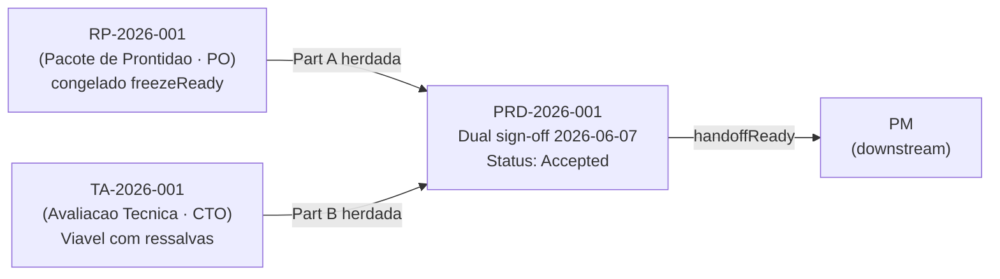
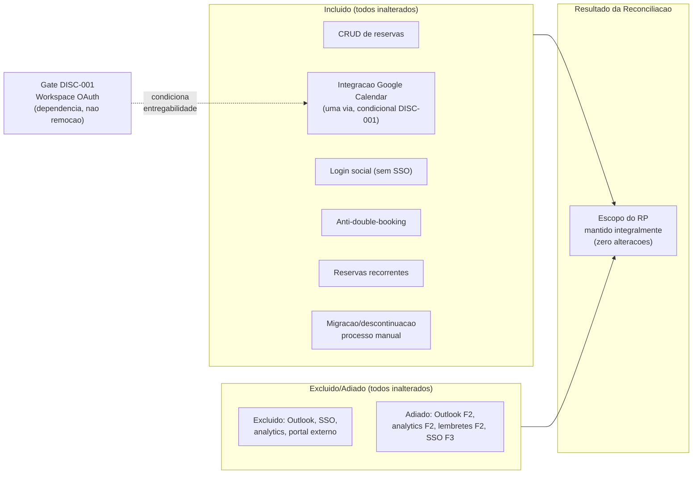
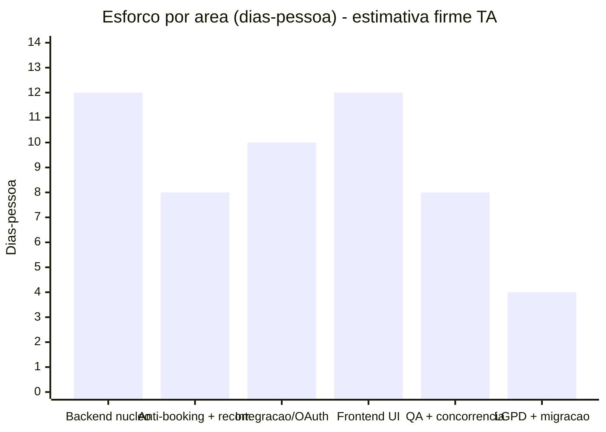

# PRD - Reserva de Salas de Reuniao

---

### Status do merge - PRD-2026-001

| Campo | Valor |
|---|---|
| **PRD ID** | PRD-2026-001 |
| **RP vinculado** | RP-2026-001 (produto, PO) |
| **TA vinculado** | TA-2026-001 (tecnico, CTO) |
| **Escalado?** | Sim |
| **Dual sign-off** | PO + CTO em 2026-06-07 |
| **Veredito** | Viavel com ressalvas |
| **Status** | Accepted |
| **Entregue ao PM em** | 2026-06-07 |
| **Prontidao estimada** | 92% |



---

## Metadados

| Campo | Valor |
|---|---|
| **PRD ID** | PRD-2026-001 |
| **Versao** | v1 |
| **RP Vinculado** | RP-2026-001 v1 |
| **Avaliacao Tecnica Vinculada** | TA-2026-001 v1 |
| **Intake Vinculado** | INT-2026-001 |
| **Escalado?** | Sim (TA incorporado) |
| **Natureza da Demanda** | Hibrido |
| **Autores** | PO + CTO |
| **Status** | Accepted |
| **Idioma de saida** | pt-BR |
| **Entregue ao PM em** | 2026-06-07 |

## Historico de revisoes

| Versao | Data | Autor | Status | Resumo |
|---|---|---|---|---|
| v1 | 2026-06-07 | Doc Updater (Fase 2 - merge inherit) | Rascunho | PRD instanciado do template; Part A herdada do RP-2026-001 (a-objectives..a-edge-cases + success-metrics) e Part B herdada do TA-2026-001 (b-feasibility..b-adrs + effort-cost firme). Origin: inherited. Secoes derivadas (exec-summary, scope-reconciliation, consolidated-risk, inherited-readiness, handoff-gate) e sign-off pendentes (Fase 3/4). |
| v1 | 2026-06-07 | Doc Updater (Fase 3 - sintetizar & reconciliar) | Draft | Secoes derivadas preenchidas: scope-reconciliation (escopo do RP mantido integralmente), consolidated-risk (11 riscos RP+TA + dependencias externas), inherited-readiness (DISC-001 aberto), exec-summary, handoff-gate. Nota de reconciliacao do a-scope resolvida. sign-off pendente (Fase 4). |
| v1 | 2026-06-07 | Doc Updater (Fase 4 - dual sign-off) | Accepted | Dual sign-off comitado: PO (RP congelado) + CTO (veredito Viavel com ressalvas carregado do TA). Secoes promovidas a po_authored/cto_authored; dispositions discovery preservadas (DISC-001). Status=Accepted; entregue ao PM 2026-06-07. handoffReady. |

---

## Assinatura

| Papel | Nome | Veredito | Data |
|---|---|---|---|
| **PO** (produto) | PO | RP Congelado (`freezeReady`) | 2026-06-07 |
| **CTO** (tecnico) | CTO | Viavel com ressalvas | 2026-06-07 |

---

## Resumo executivo combinado

**O problema.** A organizacao convive com conflito de agendamento (double-booking) cronico de salas: o agendamento se espalha por tres canais nao integrados (mural fisico, Google Forms e WhatsApp) sem nenhum mecanismo de anti-conflito. O resultado e um ritmo de cerca de 1,8 conflitos por semana (9 em 5 semanas), com impacto comercial ja quantificado: R$111 mil em negocios perdidos, R$90 mil em risco e um pipeline de aproximadamente R$700 mil de novos negocios exposto a adiamentos por conflito de agendamento. A secretaria/facilities atua como arbitro manual e gargalo a cada conflito.

**O que sera construido.** Um sistema digital de reserva de salas (natureza Hibrida: software-core novo + integracao + migracao de um processo informal) cujo nucleo e o anti-double-booking automatico sob a regra first-commit-wins: a primeira confirmacao persiste e a segunda recebe conflito, eliminando sobreposicoes parciais ou totais. O sistema inclui integracao uma-via com o Google Calendar (toda reserva confirmada/cancelada reflete em ate 2 minutos, sem retroalimentacao reversa), login social, reservas recorrentes com validacao por ocorrencia, e a migracao e descontinuacao dos canais manuais (mural, Forms e WhatsApp) em ate 2 semanas pos go-live.

**A viabilidade tecnica.** O CTO assinou o veredito "Viavel com ressalvas" (herdado da Avaliacao Tecnica, nunca re-decidido aqui). A arquitetura e solida: a integridade anti-conflito repousa sobre exclusao transacional no banco (nao read-then-write), e a sincronizacao com o Calendar e assincrona e desacoplada do commit. As ressalvas tem caminhos de resolucao conhecidos: o grant OAuth do Google Workspace e o modelo de credencial da Calendar API, mais a revisao LGPD (Juridico/DPO), confirmados no spike DISC-001 no inicio da execucao. Esforco firme de aproximadamente 54 dias-pessoa (mais spike DISC-001 de 2 a 4 dias, fora do total), com infra e custo recorrente modestos. Nao ha veto.

**O resultado esperado.** Resultados mensuraveis: zero novos double-bookings em 4 semanas pos go-live, zero novos adiamentos comerciais atribuiveis a conflito de sala em 8 semanas, e 100% das reservas migradas para o sistema digital em 2 semanas, protegendo o pipeline comercial de aproximadamente R$700 mil e estancando a perda de receita ja observada.

---

## Parte A - Definicao de produto (do Pacote de Prontidao - PO)

### A.1 Objetivos e resultado esperado

1. **Eliminar o conflito de agendamento (double-booking):** zero novos conflitos nas 4 semanas seguintes ao go-live (monitoramento + ausencia de relatos da secretaria).
2. **Proteger o pipeline comercial:** zero novos adiamentos de negocios atribuiveis a conflito de sala nas 8 semanas seguintes (acompanhamento com a lideranca comercial, D02).
3. **Migrar 100% das reservas para o sistema digital:** mural e Forms descontinuados em ate 2 semanas pos go-live; todas as reservas exclusivamente no sistema (observacao direta + confirmacao da secretaria).
4. **Integracao em tempo real com o Google Calendar:** toda reserva confirmada/cancelada reflete no Calendar em ate 2 minutos (sincronizacao uma-via) (teste funcional de integracao).

Detalhamento: RP paragrafo 3.

### A.2 Escopo (final)

**Incluido:** CRUD de reservas; integracao Google Calendar **uma via** (sistema para Calendar; reflete em ate 2 minutos; alteracoes no Calendar nao retroalimentam); login social (sem SSO); regras automaticas de anti-double-booking (sobreposicao parcial ou total); reservas recorrentes com validacao por ocorrencia (ocorrencias em conflito sinalizadas, serie nao rejeitada); migracao e descontinuacao do processo manual (mural, Forms e WhatsApp).

**Excluido:** Outlook/Microsoft 365; SSO corporativo; outros recursos fisicos; analytics avancado/relatorios; portal externo para visitantes.

**Adiado:** Outlook (Fase 2); analytics/relatorios (Fase 2); lembretes automaticos (Fase 2); SSO corporativo (Fase 3).

> Nota: escopo carregado do RP (C-Q02 sync uma-via; C-Q03 recorrencia). Reconciliacao RP x TA concluida (ver Reconciliacao de Escopo): **escopo do RP mantido integralmente**; a entregabilidade da integracao Google Calendar fica condicionada ao grant OAuth do Workspace (R1 / DISC-001).

### A.3 Personas / Jobs-to-be-done

| Persona | Job-to-be-done | Impacto pos-entrega |
|---|---|---|
| Equipes internas (colaboradores) | Reservar sala com antecedencia e ter certeza da disponibilidade. | Zero risco de double-booking; disponibilidade em tempo real; confirmacao automatica. |
| Reunioes com clientes/externos | Conduzir reunioes com visitantes de forma profissional, sem imprevistos. | Reserva confirmada elimina conflito; credibilidade preservada. |
| Lideranca e diretoria | Garantir reunioes estrategicas no horario, sem interrupcoes por conflito. | Visibilidade de ocupacao; reservas com confirmacao; protegidas por anti-conflito automatico. |
| Secretaria / Facilities (stakeholder-chave de migracao) | Manter o processo ordenado, resolver conflitos, garantir a sala certa. | Sistema assume o papel de arbitro; secretaria deixa de ser gargalo. Adesao e validacao de usabilidade sao necessarias; o sistema deve ser mais simples que o Forms. |

Detalhamento: RP paragrafo 4.

### A.4 Jornada do usuario (ponta a ponta)

Fluxo principal (Jornada A - colaborador):

| # | Acao do usuario | Resultado esperado | Touchpoint |
|---|---|---|---|
| A1 | Acessa e realiza login social | Autenticado; acesso liberado | Tela de login |
| A2 | Consulta disponibilidade em tempo real | Salas disponiveis/indisponiveis exibidas | Tela de disponibilidade |
| A3 | Escolhe sala/horario; preenche dados | Formulario validado | Formulario de reserva |
| A4 | Confirma a reserva | Validacao anti-conflito; reserva criada e confirmada | Tela de confirmacao |
| A5 | (sistema) | Sincronizacao com Google Calendar em ate 2 min | Backstage - Calendar API |
| A6 | (sistema) | Participantes recebem convite do Calendar | E-mail / Calendar |

Jornadas de referencia (no RP paragrafo 6.5): B (secretaria em nome de terceiro, modelo flat), C (recorrente, validacao por ocorrencia), e ALT-1..ALT-5.

### A.5 Regras de negocio e fluxos

Resumo das 16 regras (RN-01..RN-16) em 5 blocos; texto normativo completo em RP paragrafo 6:

- **Exclusividade / anti-double-booking (RN-01..05):** maxima 1 reserva ativa por sala/intervalo; sobreposicao parcial e conflito; validacao na confirmacao; sistema e fonte de verdade; sob concorrencia **first-commit-wins**. (C-Q01)
- **Permissoes (modelo flat) (RN-06):** qualquer usuario autenticado cria/edita/cancela qualquer reserva (campos "responsavel"/"participantes"); sem perfil admin. (C-Q04)
- **Parametros temporais (RN-09..12):** janela das 08h as 19h em dias uteis; duracao de 15 minutos a 8 horas; antecedencia maxima de aproximadamente 90 dias (valor exato a parametrizar); edicao/cancelamento ate o inicio. (C-Q05)
- **Precedencia FCFS (RN-13):** first-come, first-served; hierarquia nao sobrescreve; realocacao facilitada, mas nao automatica. (C-Q01)
- **Recorrentes (MVP) (RN-14..16):** series; validacao por ocorrencia; conflitos sinalizados; usuario decide. (C-Q03)

Fluxo de estado: Rascunho > Confirmada > Cancelada/Concluida; falha de sincronizacao mantem Confirmada (retry/backoff). Sincronizacao **uma via** (C-Q02): propaga em ate 2 minutos; alteracoes no Calendar nao retroalimentam.

### A.6 Historias de usuario e criterios de aceite

| ID | Historia | Criterio primario (Given/When/Then) |
|---|---|---|
| US-01 | Como colaborador, quero login social (Google), para nao criar nova senha. | Dado conta Google valida, quando escolho "Entrar com Google", entao sou autenticado sem cadastro adicional. |
| US-02 [CENTRAL] | Como usuario autenticado, quero bloqueio automatico de reservas sobrepostas, para garantir a sala. | Dado Sala A confirmada 14h a 15h, quando tento confirmar 14h30 a 15h30 (sobreposicao parcial), entao o sistema bloqueia e nao cria a reserva. |
| US-03 | Como usuario autenticado, quero consultar disponibilidade em tempo real. | Dado autenticado, quando seleciono data/intervalo, entao vejo quais salas estao disponiveis/ocupadas. |
| US-04 | Como usuario autenticado, quero criar reserva (sala, data, horario, titulo, participantes). | Dado autenticado e sala disponivel, quando preencho e confirmo, entao a reserva e criada "Confirmada" e aparece na consulta. |
| US-05 | Como usuario autenticado, quero editar/cancelar qualquer reserva antes do inicio. | Dado reserva confirmada nao iniciada, quando cancelo, entao o slot e liberado, o evento e removido do Calendar e os participantes sao notificados. |
| US-06 | Como participante, quero que reserva/cancelamento reflita no meu Calendar. | Dado reserva confirmada com minha participacao, quando confirmada, entao em ate 2 minutos recebo convite no Calendar. |
| US-07 | Como usuario autenticado (incl. secretaria), quero reservar em nome de terceiro. | Dado autenticado, quando crio reserva com "responsavel" outro colaborador, entao fica vinculada a ele, ao menos tao simples quanto o Forms. |
| US-08 | Como usuario autenticado, quero criar serie recorrente. | Dado ocorrencias em conflito, quando o sistema valida, entao as sem conflito sao confirmadas, as em conflito sinalizadas, e a serie nao e descartada. |

Criterios completos: RP paragrafo 7.

### A.7 Requisitos nao-funcionais (RNFs)

| ID | Dimensao | Requisito | Verificacao |
|---|---|---|---|
| NFR-01 [CRITICO] | Confiabilidade/Integridade | Nunca duas reservas confirmadas sobrepostas na mesma sala, inclusive sob concorrencia. | Teste de concorrencia; implementacao atomica (TA) |
| NFR-02 | Desempenho/Sincronizacao | Reserva confirmada/cancelada reflete no Calendar em ate 2 minutos (uma via). | Teste funcional de integracao |
| NFR-03 | Desempenho/Resposta | Consulta ate 2 s (p95); confirmacao ate 3 s (p95). | Teste de carga |
| NFR-04 [CRITICO] | Usabilidade/Adocao | Criar reserva mais simples que o Forms atual; sem treinamento formal. | Validacao qualitativa com a secretaria (RP paragrafo 11) |
| NFR-05 | Usabilidade/Responsividade | Responsivo/mobile-friendly; mobile com 360px ou mais, tablet com 768px ou mais. | Fluxo critico testado em mobile |
| NFR-06 | Seguranca/Autenticacao | Acesso so via login social; reserva atribuivel a usuario; SSO fora. | Revisao de controle de acesso |
| NFR-07 | Seguranca/Privacidade | LGPD basico; base legal/retencao/exclusao a definir. | Revisao obrigatoria Juridico/DPO antes do release |
| NFR-08 | Compatibilidade/Interoperabilidade | Interopera so com Google Calendar (uma via); Outlook fora. | Testes de integracao |
| NFR-09 | Confiabilidade/Disponibilidade | Disponibilidade de 99% ou mais em horario comercial; sem SLA 24/7. | Testes de disponibilidade |
| NFR-10 | Eficiencia/Escala | Suporta aproximadamente 200 usuarios; pico das 10h as 16h. | Testes de carga |

Cada NFR se emparelha 1:1 com `b-nfr-feasibility` (invariante A.7 com B.4).

### A.8 Casos de borda e modos de falha

- **EC-01** Reservas concorrentes: first-commit-wins; a segunda recebe conflito com alternativa. (C-Q01)
- **EC-02** Falha da Calendar API: reserva confirmada/cancelada localmente; status "sincronizacao pendente"; retry/backoff; nada e revertido.
- **EC-03** Mural/Forms em paralelo pos go-live: canal antigo descontinuado em ate 2 semanas; reservas fora do sistema sao invalidas.
- **EC-04** Alteracao direta no Calendar: nao retroalimenta (uma via, C-Q02); slot permanece; UI alerta que Calendar e espelho.
- **EC-05** Recorrente com ocorrencia em conflito: validacao por ocorrencia; conflitos sinalizados; demais confirmadas. (C-Q03)
- **EC-06** Fuso/DST: horarios nao ambiguos com fuso local; intervalos ambiguos exigem confirmacao. (premissa mono-fuso a confirmar)
- **EC-07** Sala em manutencao: bloqueia novas reservas; existentes realocadas manualmente com notificacao.
- **EC-08** Externo sem login: nao reserva direto; organizador interno cria e convida via Calendar. (C-Q02)
- **EC-09** Edicao que cria conflito: rejeita, mantem original, informa conflito.
- **EC-10** Reserva em nome de terceiro: modelo flat (C-Q04); campo "responsavel"; sem admin.
- **EC-11** Sistema fora do ar: falha segura e visivel; nenhuma confirmacao falsa; sem fallback ao mural.
- **EC-12** Reserva no passado/alem da antecedencia: rejeitada com mensagem. (C-Q05)
- **EC-13** Divergencia silenciosa Calendar x sistema: sistema e fonte de verdade; nao detectada automaticamente; UI avisa que Calendar e espelho.

Detalhamento: RP paragrafo 9.

---

## Parte B - Definicao tecnica (da Avaliacao Tecnica - CTO)

### B.1 Veredito de viabilidade

| Campo | Valor |
|---|---|
| **Veredito** | **Viavel com ressalvas** |
| **Ressalvas** | R1: admin do Workspace permite grant OAuth a apps de terceiros (`calendar.events`) e credencial/quotas (condicionado a DISC-001); R2: first-commit-wins via exclusao transacional (nao read-then-write); R3: sync estritamente uma-via, sem reconciliacao reversa; R4: revisao LGPD Juridico/DPO antes do release. |

### B.2 Natureza e paisagem tecnica

| Campo | Valor |
|---|---|
| **Natureza** | Hibrido (processo informal: mural, Forms e WhatsApp com secretaria) + software-core novo (greenfield) + integracao Google Calendar |
| **Base de conhecimento** | `tech-landscape-room-reservation.md` (criada neste ciclo: semeada pelos ADRs greenfield + populada por DISC-001) |
| **Estado atual (brownfield)** | Processo manual (mural = fonte de verdade atual, Forms e WhatsApp); ambiente Workspace/OAuth nao documentado (condicionado a DISC-001); sem codigo legado/dados a migrar; processo sera descontinuado. |
| **Fundacao (greenfield)** | TypeScript/Node; backend NestJS/Express (REST); frontend React responsivo; PostgreSQL transacional (EXCLUSION constraint anti-overlap); worker async (transactional outbox); monorepo; PaaS gerenciada. |

### B.3 Impacto arquitetural e integracoes

**Sistemas tocados:** novo sistema (criado); Google Calendar (consumido, uma via); mural fisico (migrado/descontinuado em ate 2 semanas); Google Forms (migrado/descontinuado em ate 2 semanas); WhatsApp (descontinuado como canal).

**Impacto por area:**

| Area | Impacto | Nota |
|---|---|---|
| Modelo de dados | Entidades novas (sala, reserva com intervalo `[inicio,fim)`, usuario, serie); exclusividade de intervalo como constraint de banco (`EXCLUDE USING gist`). | Sem legado. |
| Eventos/mensageria | Sincronizacao = efeito assincrono via outbox + worker (retry/backoff), desacoplado do commit. | EC-02; idempotencia por chave da reserva. |
| Frontend | UI responsiva/mobile-first (NFR-05); disponibilidade quase em tempo real; aviso "Calendar e espelho". | Re-fetch sob demanda atende ao MVP. |
| Seguranca | OAuth2/OIDC login social (NFR-06); credencial/escopo Calendar condicionado a DISC-001; LGPD basico (NFR-07, revisao DPO). | Separar OIDC de identidade da credencial de escrita; menor privilegio. |
| Desempenho/Escala | Aproximadamente 200 usuarios; restricao critica e corretude sob concorrencia (NFR-01), nao volume; ate 2s/ate 3s p95 (NFR-03); disponibilidade de 99% ou mais (NFR-09). | PaaS + banco gerenciado suficientes. |
| Multi-tenancy | N/A (organizacao unica). | Sem abstracao especulativa. |

**Integracoes:** Google Calendar (OAuth2 / `calendar.events`) (viavel com ressalvas: config Workspace condicionado a DISC-001); login social (OAuth2/OIDC) (viavel).

### B.4 Viabilidade dos RNFs

| RNF (de A.7) | Viavel? | Abordagem | Ressalva |
|---|---|---|---|
| NFR-01 [CRITICO] | Sim | Exclusao transacional no banco (`EXCLUDE USING gist`/serializavel); first-commit-wins como invariante; harness de concorrencia (gate de release). | Nao negociavel; alto risco se feito na aplicacao. |
| NFR-02 | Com ressalvas | Worker async (fila + retry/backoff); folga ampla; reserva persiste independente do sync. | Condicionado a DISC-001: quotas/credencial. |
| NFR-03 | Sim | Indices + consulta simples; alvos confortaveis na escala. | Validar p95 no pico. |
| NFR-04 [CRITICO] | Com ressalvas | UX: fluxo mais curto que o Forms; validacao com a secretaria. | Validado por produto, nao arquitetura. |
| NFR-05 | Sim | Front responsivo validado nos breakpoints. | Testar em mobile real. |
| NFR-06 | Com ressalvas | Login social OAuth/OIDC; reserva atribuida a user_id; sem SSO. | Condicionado a DISC-001: consent/escopos/dominio. |
| NFR-07 | Com ressalvas | Criptografia em repouso; retencao de 12 meses; exclusao a pedido. | Revisao Juridico/DPO; bloqueante para release. |
| NFR-08 | Com ressalvas | So Calendar API, uma via; Outlook excluido; reusa worker/credencial. | Condicionado a DISC-001; risco de desvio de escopo (R05). |
| NFR-09 | Sim | PaaS gerenciada + app stateless; manutencao fora do horario. | Calendar API indisponivel nao derruba o sistema. |
| NFR-10 | Sim | Carga pequena; 1 instancia + banco dimensionado. | Confirmar em teste de carga. |

```mermaid
flowchart TD
    subgraph A7["A.7 - Requisitos Nao-Funcionais (RP)"]
        N1["NFR-01 CRITICO\nConfiabilidade/Integridade"]
        N2["NFR-02\nDesempenho/Sincronizacao"]
        N3["NFR-03\nDesempenho/Resposta"]
        N4["NFR-04 CRITICO\nUsabilidade/Adocao"]
        N5["NFR-05\nUsabilidade/Responsividade"]
        N6["NFR-06\nSeguranca/Autenticacao"]
        N7["NFR-07\nSeguranca/Privacidade"]
        N8["NFR-08\nCompatibilidade"]
        N9["NFR-09\nDisponibilidade"]
        N10["NFR-10\nEficiencia/Escala"]
    end

    subgraph B4["B.4 - Viabilidade (CTO/TA)"]
        V1["Sim\nEXCLUDE USING gist"]
        V2["Com ressalvas\ncondicionado a DISC-001"]
        V3["Sim\nindices + consulta"]
        V4["Com ressalvas\nvalidado por produto"]
        V5["Sim\nresponsivo breakpoints"]
        V6["Com ressalvas\ncondicionado a DISC-001"]
        V7["Com ressalvas\nbloqueante DPO"]
        V8["Com ressalvas\ncondicionado a DISC-001"]
        V9["Sim\nPaaS stateless"]
        V10["Sim\n1 instancia"]
    end

    N1 --> V1
    N2 --> V2
    N3 --> V3
    N4 --> V4
    N5 --> V5
    N6 --> V6
    N7 --> V7
    N8 --> V8
    N9 --> V9
    N10 --> V10
```



**Resumo da viabilidade dos RNFs:**

| Veredito | NFRs |
|---|---|
| Sim (sem ressalva) | NFR-01, NFR-03, NFR-05, NFR-09, NFR-10 |
| Com ressalvas (condicionado a DISC-001) | NFR-02, NFR-06, NFR-08 |
| Com ressalvas (produto, validacao secretaria) | NFR-04 |
| Com ressalvas (bloqueante Juridico/DPO) | NFR-07 |

### B.5 Principais alternativas consideradas

| Alternativa | Por que NAO foi escolhida |
|---|---|
| Sincronizacao bidirecional Calendar com sistema | Fora do escopo (C-Q02); exige webhooks/reconciliacao; uma-via atende sem a complexidade. |
| Google Calendar como fonte de verdade (sem banco) | Calendar API nao garante exclusividade transacional/first-commit-wins (TA-Q03); o sistema precisa ser fonte de verdade (RN-04). |
| Persistencia NoSQL/documento | Exclusividade de intervalo exigiria coordenacao aplicacional fragil; escala modesta nao justifica; relacional resolve direto. |
| Validacao otimista sem trava transacional | Janela de corrida; nao garante first-commit-wins (RN-05, EC-01); transacao/serializavel e a unica que satisfaz NFR-01. |

### B.6 Restricoes duras

| Restricao | Efeito no escopo |
|---|---|
| Exclusividade transacional / first-commit-wins (NFR-01) | Define a persistencia: store transacional com nao sobreposicao; sem garantia transacional, descartado. |
| Sincronizacao uma-via sistema para Calendar | Sem webhooks de entrada, sem bidirecional; Calendar e espelho read-only. |
| So Google Calendar; sem Outlook; sem SSO | Login social e o unico modelo de identidade; inclusoes disparam R05 e reavaliacao do TA. |
| Conformidade LGPD basica (NFR-07) | Revisao Juridico/DPO obrigatoria antes do release; retencao/exclusao como aceite. |
| Dependencia da config do Google Workspace (grant OAuth) | Gate de Discovery (DISC-001); se negado, redefinir o escopo da integracao. |

### B.7 ADRs (nivel arquitetural)

| # | Decisao | Sign-off CTO |
|---|---|---|
| ADR-001 | Persistencia relacional transacional com nao sobreposicao (intervalos `[inicio,fim)` por sala; `EXCLUDE USING gist` ou serializavel). | ✓ |
| ADR-002 | Sincronizacao uma-via assincrona via transactional outbox + worker idempotente (retry/backoff). | ✓ |
| ADR-003 | Sistema = fonte de verdade; Calendar = espelho read-only; sem reconciliacao de volta neste release. | ✓ |
| ADR-004 | Autenticacao federada OAuth2/OIDC (login social Google); sem senha propria; sem SSO neste release. | ✓ |
| ADR-005 | Tempo em UTC com fuso explicito; premissa mono-fuso; tratar DST ambiguo (EC-06). | ✓ |
| ADR-006 | Modelo de credencial da Calendar API: A DECIDIR no spike DISC-001 (service account com delegacao de dominio vs delegacao por usuario). | - (condicionado a DISC-001) |

---

## Reconciliacao de escopo

| Item original (RP) | Alteracao pos Avaliacao Tecnica | Motivo |
|---|---|---|
| CRUD de reservas | Inalterado | Nenhuma restricao/ressalva do TA toca o item. |
| Integracao Google Calendar uma via (ate 2 minutos) | Inalterado (entregabilidade **condicionada** ao grant OAuth do Workspace) | Restricoes "sync uma-via" e R3 afirmam o item; "dependencia da config do Workspace" e R1 sao gate de Discovery (DISC-001) sobre a entregabilidade (dependencia, nao remocao/revisao de escopo). |
| Login social (sem SSO) | Inalterado | "So Google; sem Outlook; sem SSO" afirma o item; R1 condiciona apenas consent/escopos. |
| Anti-double-booking (sobreposicao parcial/total) | Inalterado | "Exclusividade transacional / first-commit-wins" e R2 especificam o mecanismo (ja em NFR-01/ADR-001), nao mudam escopo. |
| Reservas recorrentes (validacao por ocorrencia) | Inalterado | Nenhuma restricao toca o item. |
| Migracao/descontinuacao do processo manual | Inalterado | Nenhuma restricao toca o item. |
| Excluido: Outlook/M365; SSO; outros recursos; analytics; portal externo | Inalterado | "So Google; sem Outlook; sem SSO" confirma as exclusoes. |
| Adiado: Outlook (F2); analytics (F2); lembretes (F2); SSO (F3) | Inalterado | Nenhuma restricao altera os adiamentos. |
| Conformidade LGPD (NFR-07) | Inalterado | R4 (revisao Juridico/DPO antes do release) ja refletida em NFR-07; bloqueante de release, nao mudanca de escopo. |

**Sintese:** Escopo do RP **mantido integralmente**. As restricoes e ressalvas do TA afirmam ou condicionam itens ja escopados, sem adicionar, remover ou redefinir o escopo. A entregabilidade da integracao Google Calendar fica condicionada ao grant OAuth do Workspace (R1 / gate DISC-001): dependencia registrada em `inherited-readiness` e `consolidated-risk`. Nenhum item de a-scope foi alterado.

> **Reconciliacao de escopo - Sintese visual**
>
> Todos os 9 itens avaliados resultaram em **Inalterado**. O escopo do RP-2026-001 foi mantido integralmente apos a Avaliacao Tecnica. A integracao com o Google Calendar permanece no escopo, com a entregabilidade condicionada ao grant OAuth do Workspace (R1 / DISC-001) - trata-se de uma dependencia de gate, nao de remocao ou revisao de escopo.



---

## Visao consolidada de riscos e dependencias

| Risco | Origem | Tipo | Probabilidade | Impacto | Mitigacao |
|---|---|---|---|---|---|
| Baixa adocao / resistencia (usuarios voltam ao habito antigo) | RP | Produto/Adocao | Alta | Alto | NFR-04 [CRITICO]: fluxo mais simples que o Forms; validacao com a secretaria (RP paragrafo 11); secretaria como agente de mudanca. |
| Dependencia da secretaria na migracao | RP | Externo/Adocao | Media | Alto | Engajar a secretaria como stakeholder-chave (D01); modelo flat reduz dependencia de perfil unico. |
| Retorno ao mural/Forms em paralelo | RP | Produto/Adocao | Media-Alta | Alto | Descontinuacao formal do canal antigo em ate 2 semanas (EC-03); reservas fora do sistema sao invalidas (RN-04). |
| R$90k em risco nao recuperado | RP | Negocio | Media | Medio | Acompanhamento com a lideranca comercial (D02); zero novos adiamentos em 8 semanas. |
| Desvio de escopo de integracao (bidirecional/Outlook/SSO) | RP | Produto/Escopo | Baixa-Media | Medio | Escopo fixado (RP paragrafo 5; restricoes B.6); qualquer adicao dispara R05 e reavaliacao do TA; sincronizacao uma-via mantida. |
| Workspace nega/restringe grant OAuth (`calendar.events`) | TA | Externo/Integracao | Media | Alto | Antecipar DISC-001; plano B de credencial (TA-Q01); escalar ao admin cedo. **Gate** da integracao (D03). |
| Race condition no anti-double-booking | TA | Tecnica | Media | Alto | NFR-01: gravacao atomica via constraint/serializavel (RN-05); harness de concorrencia (EC-01, TA-Q03). |
| Quota/latencia da Calendar API vs ate 2 minutos | TA | Integracao | Baixa-Media | Medio | Worker async com backoff; margem de 2 minutos e folgada; monitorar quota (TA-Q04). |
| Divergencia silenciosa Calendar com sistema | TA | Dados | Media | Medio | Aviso na UI (Calendar e espelho: EC-04/EC-13); sistema e fonte de verdade (RN-04/C-Q02). |
| Fuso/DST | TA | Dados | Baixa | Medio | UTC com fuso explicito; bloquear intervalos ambiguos (EC-06); confirmar mono-fuso. |
| Falha de sincronizacao deixa estado inconsistente | TA | Integracao | Baixa | Medio | Outbox + retry idempotente; reserva confirmada localmente independe da sincronizacao (EC-02). |

**Dependencias externas conhecidas:** admin do Google Workspace (grant OAuth / DISC-001 / R1: unico gatilho possivel de revisao de escopo); Secretaria/Facilities (adesao, validacao UX/NFR-04, migracao: D01); Lideranca comercial (recuperacao do pipeline de R$90k, confirmar adiamentos: D02); Google Calendar API disponivel + integracao com riscos mitigados (D03, ligado a DISC-001).

```mermaid
quadrantChart
    title Matriz de Riscos Consolidados (Probabilidade x Impacto)
    x-axis Baixa --> Alta
    y-axis Baixo --> Alto
    quadrant-1 Critico (agir imediatamente)
    quadrant-2 Alta prioridade (monitorar)
    quadrant-3 Baixa prioridade (aceitar/registrar)
    quadrant-4 Moderado (planejar mitigacao)
    Baixa adocao RP: [0.75, 0.85]
    Dependencia secretaria RP: [0.50, 0.80]
    Retorno ao mural RP: [0.65, 0.80]
    R90k em risco RP: [0.50, 0.55]
    Desvio de escopo RP: [0.30, 0.55]
    Workspace nega OAuth TA: [0.50, 0.82]
    Race condition anti-booking TA: [0.50, 0.80]
    Quota Calendar API TA: [0.30, 0.52]
    Divergencia Calendar TA: [0.50, 0.52]
    Fuso DST TA: [0.20, 0.52]
    Falha sincronizacao TA: [0.20, 0.50]
```

---

## Esforco e custo (firme)

| Area | Estimativa | Senioridade |
|---|---|---|
| Backend: nucleo de reservas | 12 dias | Pleno (revisao Senior) |
| Backend: anti-double-booking + recorrencia | 8 dias | Senior |
| Integracao / OAuth: Calendar + login social | 10 dias | Senior |
| Frontend: UI responsiva | 12 dias | Pleno |
| QA: incluindo harness de concorrencia | 8 dias | QA |
| LGPD basica + migracao/descontinuacao | 4 dias | Pleno |
| **Total (desenvolvimento)** | **aproximadamente 54 dias-pessoa** | (mais spike DISC-001 de 2 a 4 dias, fora do total) |

**Infra / Terceiros / Opex recorrente:** infra modesta (1 app host + 1 banco gerenciado + 1 worker; sem multi-regiao/Kubernetes); terceiros de baixo custo (Calendar API na quota gratuita: confirmar no spike; login social Google gratuito; sem licencas); opex recorrente baixo. O TCO cria fundacao reutilizavel (Outlook Fase 2, SSO Fase 3, analytics Fase 2). Estimativa firme substitui a preliminar do RP paragrafo 13 (deferida).



---

## Prontidao herdada e disposicoes em aberto

| Campo | Valor |
|---|---|
| **Premissas ainda a validar** | Lado-produto: nenhuma OPEN (RP resolvidas em D003+D005). Pontos de atencao ativos para o PM/implementacao: (1) EC-06 premissa de mono-fuso (ADR-005); (2) antecedencia maxima exata (aproximadamente 90 dias, RN-09..12) a parametrizar; (3) ALT-1 sugestao de alternativas (UX) a definir; (4) US-05 confirmacao anti-cancelamento acidental (modelo flat) a definir; (5) Persona 4 (secretaria) conf 76 (entrevista recomendada antes do gate). |
| **Incognitas de Discovery** | RP Discovery RESOLVIDO (D003+D005, 2026-06-06). TA Discovery **DISC-001 EM ABERTO**: ambiente Google Workspace/OAuth nao documentado (escopos concediveis, grant a apps de terceiros, modelo de credencial [ADR-006], quotas Calendar API). Gating: NFR-02/06/08 + ADR-006 + re-firmacao da estimativa de integracao. |
| **Requisitos delegados (com responsavel)** | (1) Avaliacao Tecnica: antes delegada pelo RP, agora ASSINADA (TA-2026-001, Viavel com ressalvas); delegacao encerrada. (2) Spike DISC-001: owner CTO/Tech Lead + TI da organizacao; de 2 a 4 dias; cobre R1. (3) Revisao LGPD (NFR-07/R4): owner Juridico/DPO; bloqueante antes do release. |

**Gatilho de re-triagem (downstream):** se uma premissa carregada se provar falsa na execucao (por exemplo: mono-fuso EC-06, ou grant OAuth do Workspace negado R1/DISC-001), a demanda e re-triada, nao corrigida em silencio.

> **Dependencias externas e followups em aberto**

| Item | Tipo | Owner | Prazo/Janela | Bloqueante de |
|---|---|---|---|---|
| DISC-001 (spike Google Workspace/OAuth) | Discovery em aberto | CTO/Tech Lead + TI organizacao | 2 a 4 dias (inicio da execucao) | NFR-02, NFR-06, NFR-08, ADR-006, estimativa integracao |
| Revisao LGPD/DPO (NFR-07/R4) | Delegado/Bloqueante | Juridico/DPO | Antes do release | Release em producao |
| Entrevista com secretaria (Persona 4, conf 76) | Atencao de produto | PM/PO | Antes do gate | Validacao NFR-04 |
| Mono-fuso EC-06 (ADR-005) | Premissa a confirmar | PM/Tech Lead | Antes da implementacao | Tratamento de DST |
| Antecedencia maxima RN-09..12 (~90 dias) | Parametro a definir | PM/PO | Antes da implementacao | Regras de negocio |

---

## Criterios de sucesso e metricas (projetadas)

| Tipo | Metrica | Baseline | Meta pos-rollout | Janela | Confianca |
|---|---|---|---|---|---|
| Primaria (lagging) | Double-bookings/semana | Aproximadamente 1,8/semana (9 em 5 semanas) | 0 | 4 semanas pos go-live | Alta |
| Primaria (lagging) | Novos adiamentos de negocios por conflito | 9 em 5 semanas | 0 | 8 semanas pos go-live | Media (depende de D02) |
| Leading | Adocao (% reservas no sistema) | 0% | 100% | 2 semanas pos go-live | Alta |
| Guardrail | Volume total de reservas/semana | a medir pre-go-live | nao cair vs baseline | Semana 1 | Media |
| Guardrail | Carga de remarcacao da secretaria | a medir pre-go-live | nao aumentar vs baseline | 4 semanas | Media |

Nota financeira (referencia, nao metrica do sistema): pipeline de aproximadamente R$700k; R$111k perdidos; R$90k em risco (monitorar com D02).

---

## Handoff ao PM - Gate de aceite

| Checklist de entrega | OK? |
|---|---|
| RP congelado (`freezeReady`) e referenciado | ✓ |
| Avaliacao Tecnica assinada (ou N/A justificado) | ✓ |
| Reconciliacao de escopo registrada | ✓ |
| Riscos e dependencias consolidados | ✓ |
| Dependencias externas explicitas | ✓ |
| Disposicoes em aberto visiveis | ✓ |

**Prioridade e contexto de negocio (por que esta demanda, agora):** Conflito de agendamento (double-booking) cronico, com ritmo de aproximadamente 1,8 conflitos por semana (9 em 5 semanas) e impacto comercial quantificado: R$111k ja perdidos, R$90k em risco, pipeline de aproximadamente R$700k acompanhado com a lideranca comercial (D02). O custo de esperar cresce a cada semana: cada conflito erode a credibilidade em reunioes com clientes e adia negocios. A integracao teve seus riscos mitigados e foi considerada viavel ("Viavel com ressalvas", TA-2026-001); o unico gatilho possivel de revisao de escopo e a negacao do grant OAuth pelo admin do Workspace (R1 / DISC-001). Escala modesta (aproximadamente 200 usuarios, janela das 08h as 19h, organizacao unica); a restricao critica e corretude sob concorrencia (NFR-01), nao volume. Migracao e descontinuacao do processo manual em ate 2 semanas pos go-live.

> Nota de autoridade: o PM tem autoridade explicita para rejeitar o PRD e devolver com lacunas especificas (nao um generico "precisa de mais detalhes"). A rejeicao e o motivo entram no Historico de Revisoes; o PO endereca lacunas de produto, o CTO as tecnicas (reabrindo apenas a metade afetada), e a versao e incrementada.

---

## Fontes e registro de proveniencia

Este apendice consolida os blocos de proveniencia de todas as secoes, relocados aqui para manter o corpo do documento limpo. Cada entrada e rastreavel de volta a secao correspondente.

---

**Assinatura**
- Confianca: 90
- Origem: po_authored + cto_authored
- Fonte: RP-2026-001 congelado (PO) + TA-2026-001 veredito carregado (CTO)
- Situacao: respondida
- Disposicao: decided (dual sign-off comitado; handoffReady)
- Observacao: o veredito e carregado do TA, nunca re-decidido no PRD; ressalvas R1..R4 e DISC-001 viajam para a execucao.

---

**Resumo executivo combinado**
- Confianca: 80
- Origem: po_authored (composicao do PO; antes synthesized)
- Fonte: a-objectives + a-scope + b-feasibility + effort-cost + success-metrics
- Situacao: respondida
- Disposicao: synthesized
- Observacao: nenhum fato novo; confianca limitada pelo input mais fraco (effort-cost 72) e pela ressalva R1 ainda aberta; sobe quando DISC-001 fecha.

---

**A.1 Objetivos e resultado esperado**
- Confianca: 85
- Origem: po_authored (confirmado pelo PO no sign-off; antes inherited)
- Fonte: RP paragrafo 3
- Situacao: herdada
- Disposicao: inherited
- Observacao: metas/prazos propostos no RP; outcomes nao outputs.

---

**A.2 Escopo (final)**
- Confianca: 83
- Origem: po_authored (confirmado pelo PO no sign-off; antes inherited)
- Fonte: RP paragrafo 5
- Situacao: herdada
- Disposicao: inherited
- Observacao: reconciliacao final pendente (scope-reconciliation); qualquer adicao ao incluido dispara o risco R05.

---

**A.3 Personas / Jobs-to-be-done**
- Confianca: 76
- Origem: po_authored (confirmado pelo PO no sign-off; antes inherited)
- Fonte: RP paragrafo 4
- Situacao: herdada
- Disposicao: inherited
- Observacao: conf 76 < 80 (entrevista rapida com a secretaria recomendada antes do gate).

---

**A.4 Jornada do usuario**
- Confianca: 80
- Origem: po_authored (confirmado pelo PO no sign-off; antes inherited)
- Fonte: RP paragrafo 6.5
- Situacao: herdada
- Disposicao: inherited
- Observacao: ALT-1 (sugestao de alternativas) sem decisao fechada (definir antes da implementacao).

---

**A.5 Regras de negocio e fluxos**
- Confianca: 88
- Origem: po_authored (confirmado pelo PO no sign-off; antes inherited)
- Fonte: RP paragrafo 6
- Situacao: herdada
- Disposicao: inherited
- Observacao: antecedencia maxima (aproximadamente 90 dias) a parametrizar antes da implementacao.

---

**A.6 Historias de usuario e criterios de aceite**
- Confianca: 88
- Origem: po_authored (confirmado pelo PO no sign-off; antes inherited)
- Fonte: RP paragrafo 7
- Situacao: herdada
- Disposicao: inherited
- Observacao: US-05 (modelo flat) (considerar confirmacao explicita anti-cancelamento acidental antes da implementacao).

---

**A.7 Requisitos nao-funcionais**
- Confianca: 82
- Origem: po_authored (confirmado pelo PO no sign-off; antes inherited)
- Fonte: RP paragrafo 8
- Situacao: herdada
- Disposicao: inherited
- Observacao: NFR-07 (LGPD) exige revisao Juridico/DPO antes do release.

---

**A.8 Casos de borda e modos de falha**
- Confianca: 80
- Origem: po_authored (confirmado pelo PO no sign-off; antes inherited)
- Fonte: RP paragrafo 9
- Situacao: herdada
- Disposicao: inherited
- Observacao: EC-06 (mono-fuso) (confirmar antes da implementacao).

---

**B.1 Veredito de viabilidade**
- Confianca: 86
- Origem: cto_authored (confirmado pelo CTO no sign-off; antes inherited)
- Fonte: TA-2026-001 paragrafo feasibility-verdict (cto_authored)
- Situacao: respondida
- Disposicao: inherited (decided - assinado sob ressalvas)
- Observacao: veredito carregado verbatim, nunca re-decidido; um veto so se materializaria se o admin do Workspace negasse o grant (R1).

---

**B.2 Natureza e paisagem tecnica**
- Confianca: 78
- Origem: cto_authored (confirmado pelo CTO no sign-off; antes inherited)
- Fonte: TA paragrafo tech-classification + paragrafo tech-foundation + paragrafo current-state
- Situacao: respondida
- Disposicao: discovery (estado-atual/Workspace - DISC-001 aberto)
- Observacao: confianca limitada pelo estado-atual (54, condicionado a DISC-001); terreno Workspace/OAuth nao documentado ate o spike.

---

**B.3 Impacto arquitetural e integracoes**
- Confianca: 78
- Origem: cto_authored (confirmado pelo CTO no sign-off; antes inherited)
- Fonte: TA paragrafo affected-systems + paragrafo architectural-impact + paragrafo integrations
- Situacao: respondida
- Disposicao: inherited (decided; credencial Calendar condicionado a DISC-001)
- Observacao: modelo de credencial Calendar nao resolvido ate DISC-001.

---

**B.4 Viabilidade dos RNFs**
- Confianca: 80
- Origem: cto_authored (confirmado pelo CTO no sign-off; antes inherited)
- Fonte: TA paragrafo nfr-feasibility (cto_authored)
- Situacao: respondida
- Disposicao: inherited (decided; NFR-02/06/08 com ressalvas condicionados a DISC-001; NFR-07 condicionado a DPO)
- Observacao: NFR-01/03/05/09/10 sem ressalva; NFR-02/06/08 condicionados a DISC-001; NFR-07 exige Juridico/DPO.

---

**B.5 Principais alternativas consideradas**
- Confianca: 76
- Origem: cto_authored (confirmado pelo CTO no sign-off; antes inherited)
- Fonte: TA paragrafo alternatives (cto_authored)
- Situacao: respondida
- Disposicao: inherited (decided)
- Observacao: secao nao bloqueante; previne relitigacao downstream.

---

**B.6 Restricoes duras**
- Confianca: 80
- Origem: cto_authored (confirmado pelo CTO no sign-off; antes inherited)
- Fonte: TA paragrafo hard-constraints (cto_authored)
- Situacao: respondida
- Disposicao: inherited (decided; Workspace condicionado a DISC-001)
- Observacao: alimentam scope-reconciliation; a restricao de Workspace e o unico gatilho possivel de revisao de escopo.

---

**B.7 ADRs (nivel arquitetural)**
- Confianca: 80
- Origem: cto_authored (confirmado pelo CTO no sign-off; antes inherited)
- Fonte: TA paragrafo adrs (cto_authored)
- Situacao: respondida
- Disposicao: inherited (decided ADR-001..005 ✓; discovery ADR-006)
- Observacao: ADR-006 nao definido; detalhamento fino vai ao Tech Backlog.

---

**Reconciliacao de escopo**
- Confianca: 80
- Origem: po_authored (composicao do PO; antes synthesized)
- Fonte: a-scope (RP paragrafo 5) + b-feasibility (R1 a R4) + b-hard-constraints
- Situacao: respondida
- Disposicao: decided (escopo mantido integralmente)
- Observacao: entregabilidade da integracao condicionada a R1/DISC-001 (dependencia, nao remocao); se o grant for negado, redefinir o escopo (gatilho upstream).

---

**Visao consolidada de riscos e dependencias**
- Confianca: 78
- Origem: po_authored (composicao do PO; antes synthesized)
- Fonte: RP paragrafo 12 (R01 a R05 + D01 a D03) + TA tech-risks (6)
- Situacao: respondida
- Disposicao: decided (composto; nenhum risco novo inventado)
- Observacao: o risco de grant OAuth do Workspace (TA) e o unico que pode gatilhar revisao de escopo (escalar via DISC-001/D03).

---

**Esforco e custo (firme)**
- Confianca: 72
- Origem: cto_authored (confirmado pelo CTO no sign-off; antes inherited)
- Fonte: TA paragrafo effort-cost (cto_authored)
- Situacao: respondida
- Disposicao: inherited (decided; linha OAuth a re-firmar pos-DISC-001)
- Observacao: uso interno; nao e compromisso contratual; o PM trata a linha de integracao como sujeita a ajuste pos-spike.

---

**Prontidao herdada e disposicoes em aberto**
- Confianca: 80
- Origem: po_authored (composicao do PO; antes synthesized)
- Fonte: RP dispositions (D003+D005) + TA discovery-path (R1/R4, current-state, ADR-006) + DISC-001
- Situacao: respondida
- Disposicao: discovery (DISC-001 em aberto)
- Observacao: DISC-001 gate NFR-02/06/08 + ADR-006 + linha de integracao; product-side sem premissas OPEN; 5 pontos de atencao ativos.

---

**Criterios de sucesso e metricas**
- Confianca: 80
- Origem: po_authored (confirmado pelo PO no sign-off; antes inherited)
- Fonte: RP paragrafo 10
- Situacao: herdada
- Disposicao: inherited
- Observacao: guardrails dependem de medicao na semana pre-go-live (planejar coleta).

---

**Handoff ao PM - Gate de aceite**
- Confianca: 80
- Origem: po_authored (composicao do PO; antes synthesized)
- Fonte: sign-off + scope-reconciliation + consolidated-risk + inherited-readiness (+ meta, b-feasibility)
- Situacao: respondida
- Disposicao: synthesized
- Observacao: as 6 caixas sao verificaveis a partir das secoes correspondentes do documento fundido; dual sign-off comitado (PO + CTO): todas as caixas confirmadas.

<!-- END OF DOCUMENT -->
